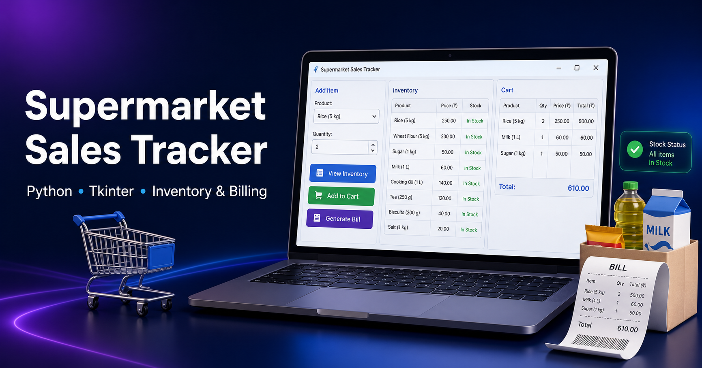

# 🛒 Supermarket Sales Tracker


A desktop-based supermarket billing and inventory management application built with Python and Tkinter.

Manage product stock, add items to a cart, validate quantities, generate bills, and keep a simple sales record—all through a clean graphical interface.

---

## 🎯 What It Does

Supermarket Sales Tracker helps manage basic supermarket sales operations by allowing users to:

- View available products, prices, units, and stock
- Select products and enter purchase quantities
- Add valid items to a shopping cart
- Prevent orders when stock is insufficient
- Update inventory after items are added
- Generate a timestamped bill
- Save sales records in a text file

---

## ✨ Features

| Feature | Description |
|---|---|
| 📦 Inventory Viewer | Displays product names, prices, units, and available stock |
| 🛒 Add to Cart | Adds selected products and quantities to the cart |
| ✅ Stock Validation | Prevents users from ordering more than the available stock |
| 🔄 Stock Updates | Reduces stock automatically when products are added |
| 🧾 Bill Generation | Creates a detailed bill with date, products, quantities, and total amount |
| 📁 Sales History | Saves each completed sale in `sales_history.txt` |
| 🖥️ Desktop GUI | Uses an easy-to-use Tkinter graphical interface |

---

## 🛠️ Tech Stack

- **Language:** Python 3
- **GUI Framework:** Tkinter
- **Libraries:** `tkinter`, `ttk`, `datetime`
- **Packaging:** PyInstaller *(optional, for creating a Windows executable)*

---

## 🚀 Run Locally

```bash
# 1. Clone the repository
git clone https://github.com/angadmaan/Supermarket_Sales_Tracker.git

# 2. Open the project folder
cd Supermarket_Sales_Tracker

# 3. Run the application
python3 supermarket.py
```

> No external Python packages are required to run the main application except tkinter.

### 🌐 Run the Showcase Website

A local portfolio-style webpage with an interactive demo of the app is included in the `website/` folder.

```bash
# From the project root
python3 website/serve.py
```

This will start a local server and open the website at `http://localhost:8000` in your browser automatically.

---

## 📸 Preview



---

## 📁 Project Structure

```text
Supermarket_Sales_Tracker/
├── supermarket.py
├── README.md
├── .gitignore
├── assets/
│   ├── icon.ico
│   └── supermarket-sales-tracker.png
├── docs/
│   └── Supermarket_Sales_Tracker.pptx
├── packaging/
│   └── supermarket_gui.spec
└── website/
    ├── index.html
    ├── style.css
    ├── app.js
    └── serve.py
```

---

## 💡 Future Improvements

- Add a database for permanent inventory storage
- Add product search and category filters
- Add a cart-view and remove-item option
- Generate PDF invoices
- Add user login and admin dashboard
- Create sales reports and analytics
- Add barcode scanning support

---

## 👤 Author

**Angad Singh Maan**  
B.Tech CSE | Cybersecurity | Linux | Networking | DevSecOps

[LinkedIn](https://linkedin.com/in/angad-singh-maan) · [GitHub](https://github.com/angadmaan)